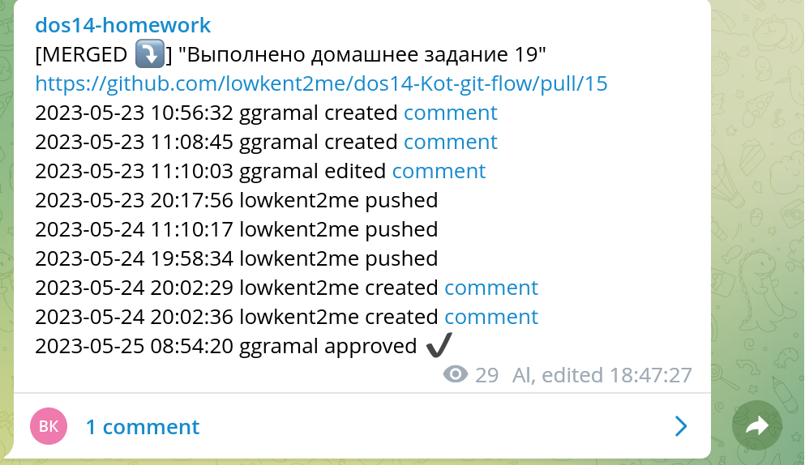

# prnotifybot

Send notifications about pull requests(PR) to chats. Supported chat platforms - Telegram

## How it works
* Sends a message in format

`[<CLOSED|OPEN|MERGED>] <PR title> <PR url>` - message header

* if the status of the PR has changed eg its closed,opened,merged. prnotifybot will edit the notification message and reflect those changes in its header
* if some one pushed code to the source branch of the PR. Notification message for this PR will be edited and new line will be added

`<timestamp> <user> pushed`

* if someone created/edited/deleted a comment or issue comment. Notification message for this PR will be edited with a new line

`<timestamp> <user> <created|deleted|edited> [comment](<link_to_comment>)`

* if someone approved the PR Notification message for this PR will be edited with a new line

`<timestamp> <user> approved :heavy_check_mark:`

## Issues
Currently prnotifybot stores message ids and thier corresponding messages in memory.
So after restart of the app new pr notification messages will be sent if one of the events described in [How it works](#how-it-works) occur

## Installation

### Slack
Not supported yet (TBD)

### Telegram

1. Register an app using https://my.telegram.org
2. Copy `App api_id` and `App api_hash`
3. Clone this project `git clone https://github.com/ggramal/smo_metrics.git`
4. Copy `.env.example` from project root to `.env` eg `cp ./.env.example ./.env`
5. Adjust variables  in `.env` file. where
  - `TG_API_ID` - `App app_id` copied from step 2
  - `TG_API_HASH` - `App app_hash` copied from step 2
  - `TG_CHAT_NAME` - Name of the channel or chat where to send notifications
6. In root of the project run `docker-compose up -d`
7. Run `docker attach prnotifybot`
8. Enter your phone number and press enter
9. Enter the authentication code that is sent to one of your telegram sessions
10. Under your github project goto `Settings -> Webhooks -> Add webhook`
  - Set payload URL to `<http|https>://your_host/webhooks/pr`. EXAMPLE: `http://34.116.235.241/webhooks/pr`
  - Set content type `application/json`
  - Set `send me everything` option
  - Save
11. Make a PR you should recieve a notification in the chat defined in `TG_CHAT_NAME`

